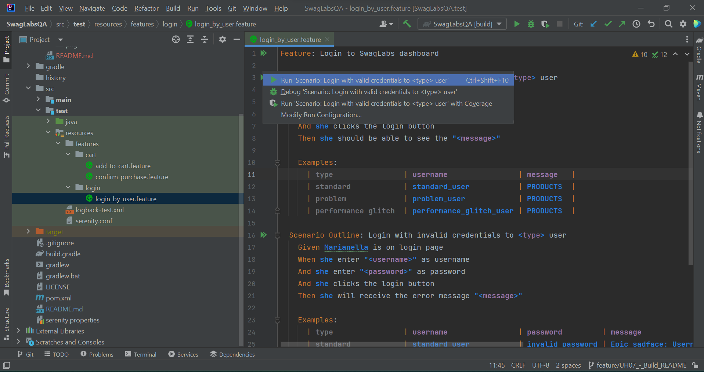
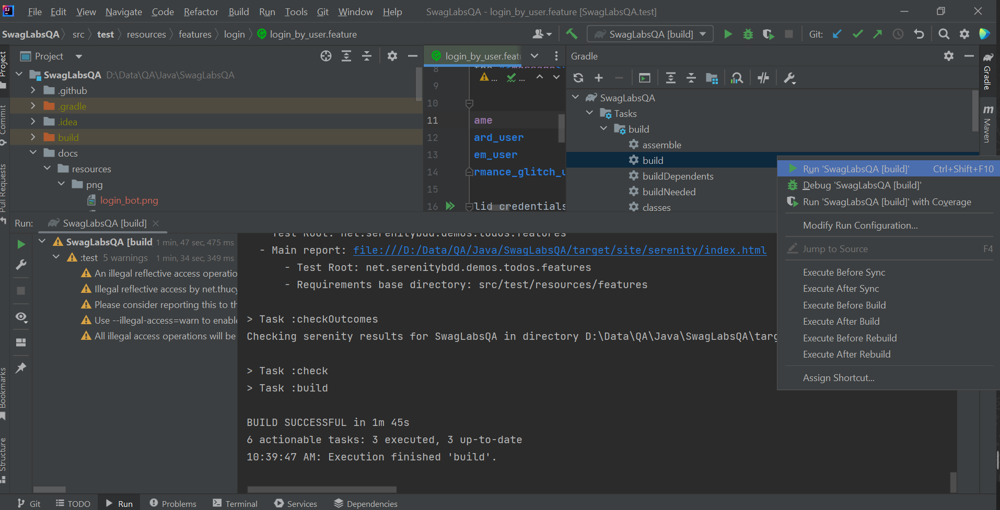
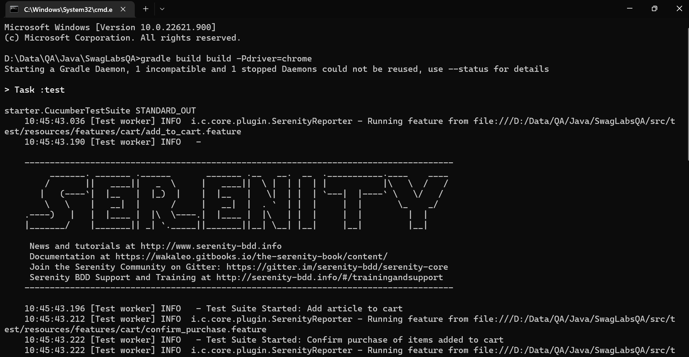
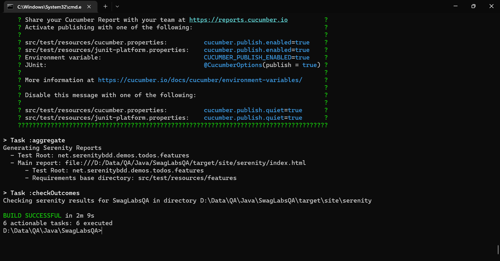

# Pruebas funcionales automátizadas para SwagLabs

<p align="center">

</p>

SwagLabs es una plataforma de comercio electrónico centrada en la venta de implementos y artículos deportivos, su intuitiva interfaz permite al usuario navegar por un listado de productos, ver su información detallada y realizar el proceso completo de compra.

Para garantizar la buena experiencia de usuario y la calidad de la plataforma se decide realizar un conjunto de pruebas fundamentadas en altos estándares que no solo permiten el seguimiento, sino también las correcciones oportunas del producto.

En este repositorio puede encontrar la implementación en código de estas pruebas funcionales así como su documentación correspondiente, esta consiste en el plan de pruebas detallado, la matriz de riesgos y el reporte de resultados.

## Conociendo los entregables

En este repositorio puede encontrar todos los entregables, en el directorio docs se encuentran los documentos que componen junto a esta implementación todos lo entregables descritos en el plan de pruebas.


## Como ejecutar el proyecto

Luego de clonar o hacer un fork sobre este repositorio para ejecutar el proyecto existen varias opciones que a continuación le serán presentadas:

### Ejecutar prueba de cada escenario
Es la manera más sencilla de ejecutar las pruebas, puede hacerlo desde el fichero de features que quiere validar. Esta ejecución es simple y rápida, pero no genera tanta información.



### Ejecutar desde las tareas de Gradle
Desde el IDE esta es la forma más completa de ejecutar las todas las pruebas, además a hacerlo construirá un reporte completo gracias a Serenity que nos enseñará a detalle los resultados de cada escenario.



### Ejecutar desde línea de comando
Para correr las pruebas sin depender de algún IDE también puede correr el siguiente comando en una línea de comandos:

```json
$ gradle build build -Pdriver=chrome
```

Esto es exactamente igual a hacerlo desde el IDE, ya que también estamos usando gradle para construir el proyecto.


Ejecutando el comando build de Gradle desde CMD


Salida en consola por la ejecución del comando
